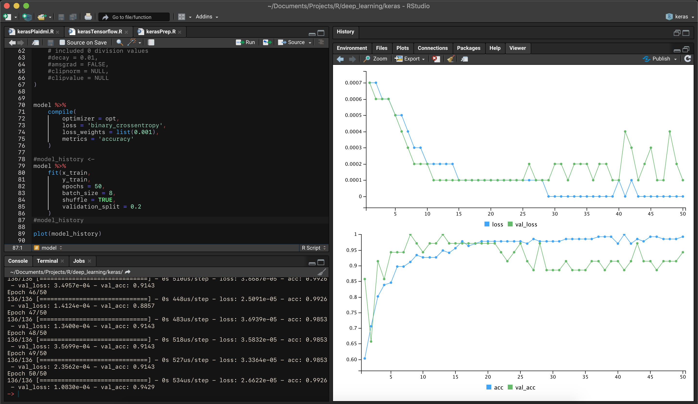

# RStudio-Customizations

This is something I did for fun, and figured other people might want to have more control over their RStudio experience.

Please create an issue if you have any problems!

### Darker RStudio with Editor Theme

> Darker Modern Theme with Solarized Dark

# Using Custom Editor Themes

RStudio has many different themes for users to choose from. However, I like how customizable text editors such as Atom and VS Code are, so I was looking for a way to fully customize RStudio to my liking.

I've included files that are located in "~/Applications/RStudio.app/Contents/Resources/www/rstudio/"
(for Mac users, this may be a bit different on Windows).

The themes I've changed are Cobalt and Solarized Dark. If you do not want to change these files specifically, you can select another one of the files located in "~/rstudio/" and paste one of these files in there. Once you've made the changes, you'll need to Quit RStudio and then Open the app once more. The changes should have been made!

## Make Your Own Custom Editor Theme
To make your own custom theme, you'll need to locate the folder that contains the .css files for themes. If your RStudio app is located in the applications folder, then the path should be
"~/Applications/RStudio.app/Contents/Resources/www/rstudio/".

Another handy tool when customizing your own theme is the "Inspect" command. Here, you can make real-time changes to RStudio and see how your theme would look.

# Using "Dark" RStudio
I've made some edits to RStudio's "Modern" theme to resemble VS Code's Dark+ theme. To use this theme, you'll need to do a few things. First, go to "~/RStudio.app/Contents/Resources/www/" and paste custom_styles.css in that directory. Next, paste "index.htm" into the same directory, and allow this file to replace the old "index.htm"